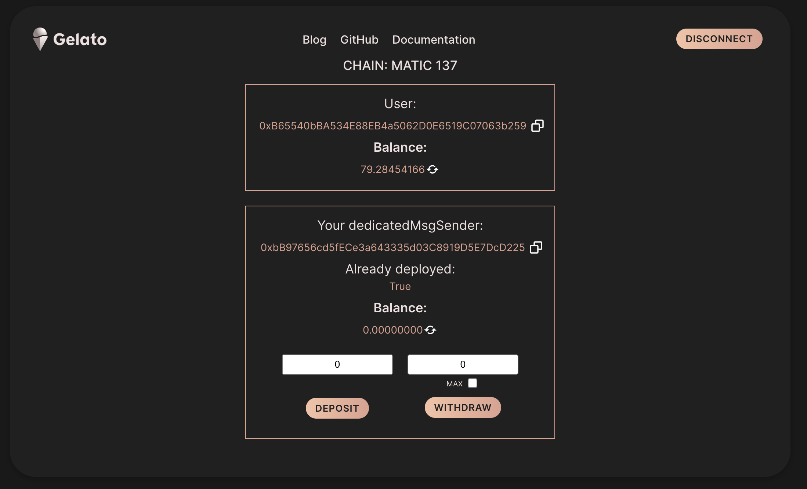

# Fund Proxy aka DedicatedMsgSender

## Summary
This simple web3 app allows you to deposit and wothdraw from your dedicatedMsgSender.
The dedicatedMsgSender is the proxy that forward all Web3 Functions executions, as well as the automate executions when module Proxy is selected.

## Web3 App
[https://fund-proxy.web.app/](https://fund-proxy.web.app/)

   